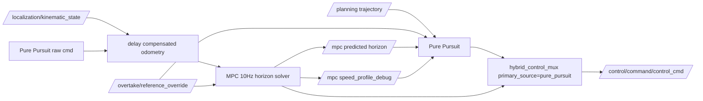

# Pure Pursuit MPC Horizon モード仕様

## 目的

`pure_pursuit_mpc_horizon` は、最終制御を Pure Pursuit に寄せつつ、MPC は制約を見た予測ホライズン生成に使うモードです。

従来の `hybrid_delay_aware_mpc` は「MPC主制御、緊急時だけPure Pursuit fallback」です。この方式はMPCが重い環境やサイドバイサイドのコーナーで infeasible が増えると、最終制御が止まりやすくなります。

新モードでは、Pure Pursuit が常に制御指令を出し、MPCが解けている時だけMPC予測ホライズンを優先して追従します。MPCが解けない時は、Pure Pursuit が通常trajectoryと overtake planner のoverrideを使って走ります。

## 起動方法

```bash
ros2 launch aichallenge_submit_launch reference.launch.xml control_method:=pure_pursuit_mpc_horizon
```

Tuning GUIでは `pure_pursuit_mpc_horizon` を選ぶと、専用launch、専用MPC YAML、Pure Pursuit launch、mux YAML、overtake planner設定を編集できます。

## 制御フロー



## 追加された主な設定

| ファイル | パラメータ | 役割 |
| --- | --- | --- |
| `delay_aware_mpc_ros/config/pure_pursuit_mpc_horizon_config.yaml` | `mpc.control_rate: 10.0` | MPC solve周期を落としてCPU負荷を下げる |
| 同上 | `mpc.N: 20` | horizon生成に必要な範囲を残しつつ、問題サイズを小さくする |
| 同上 | `mpc.predicted_horizon_publish_mode: overtake_or_neutral` | 実追い越し/merge中だけsolver予測horizonをpublishする |
| 同上 | `mpc.neutral_horizon_publish_period_sec: 0.05` | 非追い越し中は固定周期の中立horizonを出す |
| `pure_pursuit_mpc_horizon.launch.xml` | `overtake_mpc_health_solve_time_warn_ms: 200.0` | 10Hz horizon生成時だけ、overtake plannerのsolve-time guardを緩める |
| `pure_pursuit.launch.xml` | `require_solved_mpc_health_for_horizon` | MPC healthがsolvedの時だけhorizonを採用する |
| `hybrid_control_mux/config/pure_pursuit_mpc_horizon.param.yaml` | `primary_source: pure_pursuit` | 最終出力をPure Pursuit主制御にする |

## デメリットと補い方

### MPC horizon が低周期になる

MPCは10Hzなので、40Hz運用よりsolver予測horizon更新は遅くなります。非追い越し中は `neutral_horizon_publish_period_sec=0.05` の固定周期neutral horizonを使い、Pure Pursuit側は `max_mpc_horizon_age_sec=0.35` まで許容します。healthがstaleまたはunsolvedなら通常trajectoryへ戻します。

### MPCが解けない区間では制約付きの未来経路を使えない

この時はPure Pursuitが通常trajectoryを使います。ただし、overtake plannerの横オフセットと速度capはPure Pursuit側にも入るため、追従、譲り、safe stop系の速度抑制は残ります。

### Pure Pursuitだけでは壁/障害物制約を直接解かない

Pure PursuitはMPCのような最適化制約を持ちません。速度は `pure_pursuit_speed_mps`、mux側 `fallback_speed_mps`、overtake plannerのspeed capの低い値で抑える前提です。コーナーで不安定な場合は、まず速度capとlookaheadを調整します。

### PP指令が止まると最終出力も止まる

専用mux設定では `use_mpc_on_pure_pursuit_cmd_timeout=false` です。これは、PPが死んだ時に急にMPC制御へ戻して挙動が変わるリスクを避けるためです。実験としてMPC退避を許す場合だけtrueにします。

## 確認ポイント

`/pure_pursuit/debug`:

- `trajectory_source`: `mpc_horizon` ならMPC horizonを追従中
- `mpc_horizon_reject_reason`: `fresh` 以外ならhorizon不採用理由
- `mpc_health_status`: `solved` 以外なら通常trajectoryへ戻る候補
- `mpc_predicted_horizon_source`: MPC側が出したhorizon種別

`/hybrid_control_mux/debug`:

- `primary_source`: `pure_pursuit`
- `source`: 通常は `pure_pursuit`
- `fallback_active`: 通常は `false`

`/mpc/speed_profile_debug`:

- `predicted_horizon_publish_mode`: `overtake_or_neutral`
- `mpc_status`: `solved` / `infeasible`
- `mpc_predicted_horizon_source`: 通常時は `fixed_neutral_reference`、実追い越し/merge中は `solver_prediction`
