# overtake_planner ソース別コードロジック説明書

この文書は、`overtake_planner` の実装をソースファイル単位で読むための説明書です。
パラメータ調整の一覧は `02_parameter_guide.md`、安全停止の仕様は `03_safe_stop_spec.md`、未来横並び予測の設計意図は `04_side_by_side_corner_future_prediction_spec.md` を参照してください。

## 全体像

`overtake_planner` は、MPCの最適化器そのものを置き換えるのではなく、MPCやPure Pursuitが読む参照軌道に対して、短いhorizonぶんの横オフセット列と速度上限列を追加で渡すplannerです。

主な入出力は次の通りです。

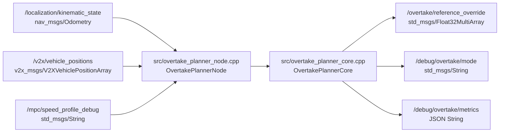

`/overtake/reference_override` の配列形式は次です。

```text
[valid, mode_id, n, d[0], ..., d[n-1], v_ref[0], ..., v_ref[n-1]]
```

| 要素 | 意味 |
| --- | --- |
| `valid` | 現状は常に `1.0`。受信側の簡易プロトコル用フラグ。 |
| `mode_id` | `BehaviorMode` の整数値。 |
| `n` | overrideが有効ならhorizon点数、無効なら0。 |
| `d[]` | Frenet横方向オフセット列。 |
| `v_ref[]` | 各horizon点の速度上限列。 |

## ソースの責務マップ

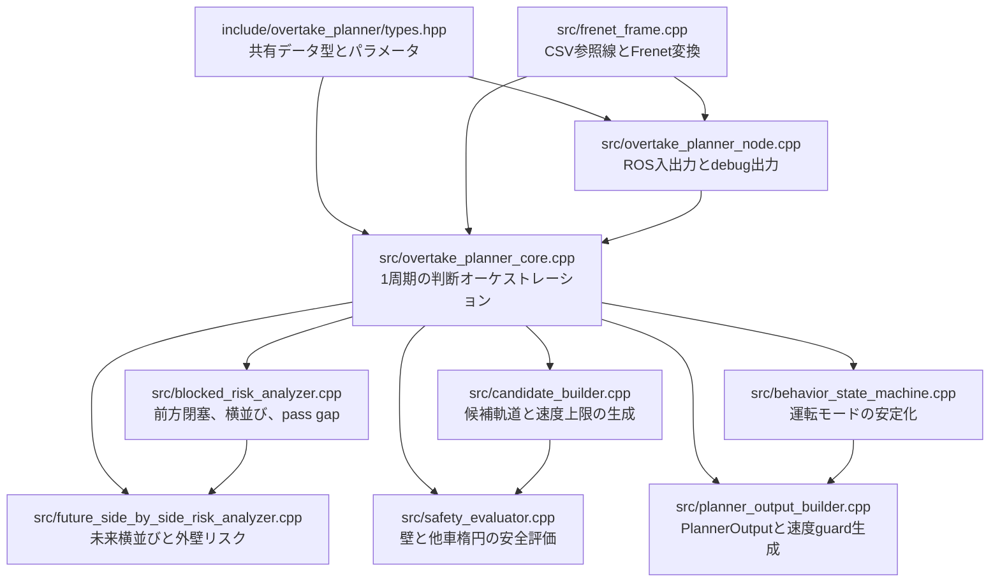

おすすめの読む順番は次です。

1. `include/overtake_planner/types.hpp`
2. `src/overtake_planner_node.cpp`
3. `src/overtake_planner_core.cpp`
4. `src/blocked_risk_analyzer.cpp`
5. `src/future_side_by_side_risk_analyzer.cpp`
6. `src/candidate_builder.cpp`
7. `src/safety_evaluator.cpp`
8. `src/behavior_state_machine.cpp`
9. `src/planner_output_builder.cpp`
10. `src/frenet_frame.cpp`

## 1周期の呼び出し順

`OvertakePlannerNode::onTimer()` が1周期の入口です。
ROSから受けた最新odomとV2Xを、自車状態と他車状態に変換してから `OvertakePlannerCore::update()` へ渡します。

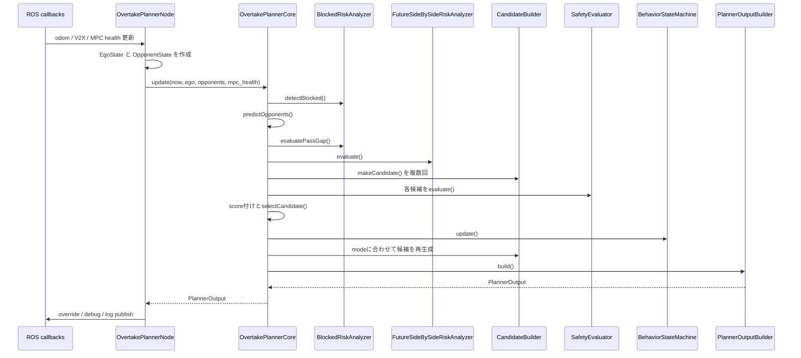

## `include/overtake_planner/types.hpp`

共有データ型を定義します。
ここを見ると、plannerがどの情報を保持しているかを最短で把握できます。

| 型 | 役割 |
| --- | --- |
| `BehaviorMode` | 状態機械が保持する現在の運転モード。例: `FREE_RUN`, `FOLLOW_BLOCKED`, `OVERTAKE_LEFT`, `YIELD_BEHIND`, `SAFE_STOP`, `SPEED_GUARD`。 |
| `CandidateType` | 1周期内で評価される候補の種類。例: `FASTEST`, `FOLLOW`, `PASS_LEFT`, `RECOVERY`, `SAFE_STOP`。 |
| `ReferencePoint` | 参照CSVの1点。`s`, `x`, `y`, `yaw`, `kappa`, `v_ref` を持つ。 |
| `FrenetPose` | 参照線に対する `s`, `d`, `yaw_error`。 |
| `EgoState` | 自車状態。odomから作られる。 |
| `OpponentState` | V2Xから作られる他車状態。速度は位置差分から推定される。 |
| `PredictedOpponent` | 他車を短いhorizonで等速予測した列。 |
| `BlockedInfo` | 前方閉塞、横並び、pass gap、未来リスクなどの判断材料をまとめた構造体。 |
| `CandidateTrajectory` | 候補軌道。`d[]`, `x[]`, `y[]`, `v_ref[]`, `feasible`, `reject_reason` を持つ。 |
| `SafeStopContext` | SAFE_STOPへの突入と解除に必要な補助状態。 |
| `PlannerConfig` | ROS parameterから渡る調整値の集約。 |
| `PlannerOutput` | ROSノードへ返す最終出力。override配列とdebug指標の元になる。 |

コードレベルで重要なのは、`BlockedInfo` と `CandidateTrajectory` が分かれている点です。


`BlockedInfo` は「何が起きているか」、`CandidateTrajectory` は「どう動く案か」、`PlannerOutput` は「実際に下流へ何を出すか」です。

## `src/overtake_planner_node.cpp`

ROS 2ノード境界です。
このファイルはplanner判断そのものより、入力の変換、パラメータ読み込み、publish、ログ出力を担当します。

### 起動時処理

`OvertakePlannerNode()` で行うことは次です。

1. `reference_package` と `reference_csv` から参照CSVのパスを解決する。
2. `own_vehicle_id` を読む。`auto` の場合は `ROS_DOMAIN_ID=N` から `dN` を作る。
3. `PlannerConfig` に対応するROS parameterを宣言して読み込む。
4. `FrenetFrame::loadCsv()` で参照線をロードする。
5. section safety ruleを読み込む。
6. `OvertakePlannerCore` を生成する。
7. odom、V2X、MPC health、timerを設定する。

`own_vehicle_id=auto` の処理は、自車をV2X上の相手として誤認しないために重要です。

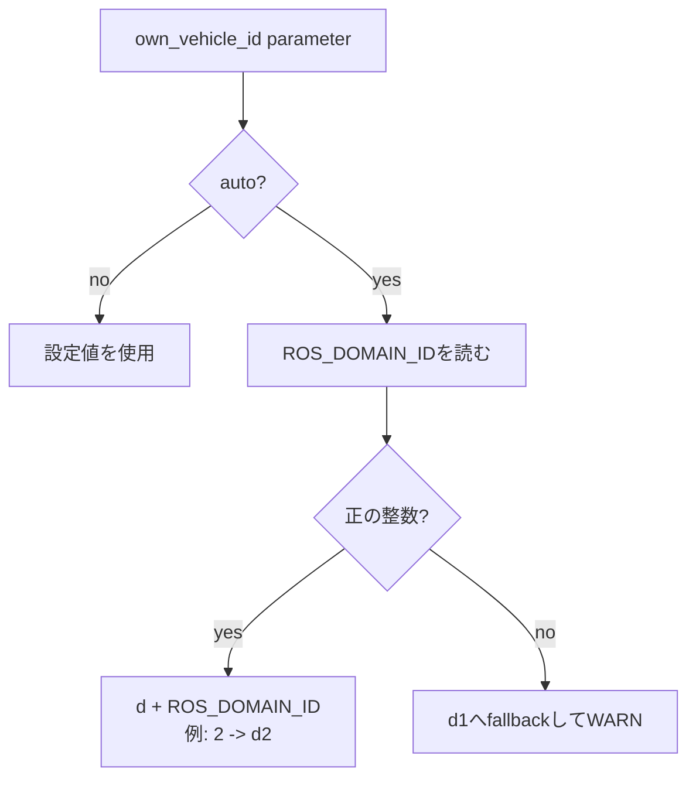

### V2X処理

`updateOpponents()` は、V2Xメッセージの各車両について、前回位置との差分から速度を推定します。

```text
dt = current_stamp - previous_stamp
jump = hypot(current_x - previous_x, current_y - previous_y)

if dt > 0 and jump <= position_jump_threshold_m:
  vx = dx / dt
  vy = dy / dt
else:
  vx = 0
  vy = 0
```

`collectOpponents()` は、内部に保存したV2X sampleを `OpponentState` へ変換します。

- `id == own_vehicle_id_` は除外する。
- 自車に近すぎる点は `ignore_near_ego_m_` で除外する。
- `frame_.cartesianToFrenet()` で `s`, `d` を付ける。
- `now_sec - sample.stamp_sec <= 2.0` の場合だけ `valid=true` にする。

### MPC health処理

`updateMpcHealth()` は `/mpc/speed_profile_debug` のJSON文字列から次を拾います。

- `mpc_infeasible_count`
- `mpc_solve_time_ms`

値が取れたときだけ `MpcHealthStatus` を有効化します。
`PlannerOutputBuilder` 側で、infeasible回数、solve time、stale時間に応じた速度guardへ使われます。

### timer処理

`onTimer()` は実行周期ごとに次を行います。

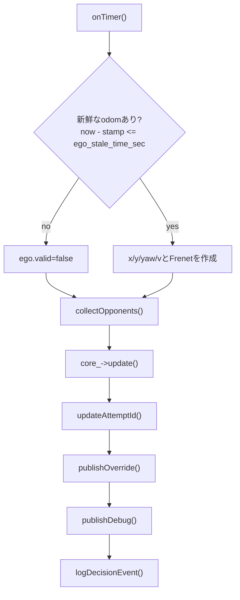

`publishOverride()` は `PlannerOutput` を `Float32MultiArray` へ変換します。
`output.active_override == false` の場合、`n=0` になり、下流は元の参照を使います。

`publishDebug()` は解析用JSONを出します。
見るべき主なkeyは次です。

- `mode`
- `selected`
- `blocked`
- `side_by_side`
- `future_yield_required`
- `front_vehicle_id`
- `side_vehicle_id`
- `can_pass_left`
- `can_pass_right`
- `pass_gap_reason`
- `safe_stop_reason`
- `speed_cap_reason`
- `active_override`
- `reason`

## `src/overtake_planner_core.cpp`

plannerの中核です。
このファイルは個別判断の計算を全部抱えず、各クラスを呼ぶ順番と、モードに応じた再選択を管理します。

### `update()` の大まかな処理

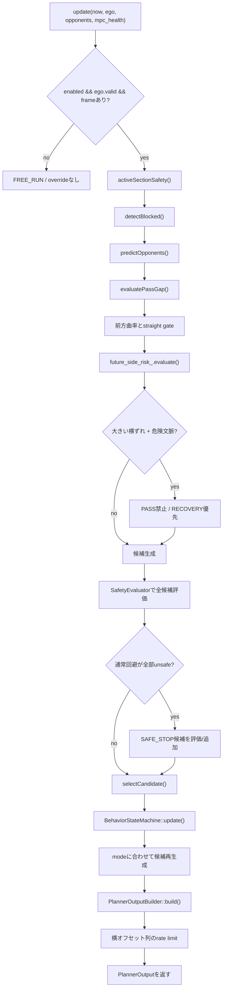

### 早期return

次のどれかならplannerは介入しません。

- `config_.enabled == false`
- `ego.valid == false`
- 参照線が空

この場合、`mode_` は `FREE_RUN`、`reason` は `disabled_or_invalid` になります。
override配列は初期値として `d=0`、`v_ref=v_passthrough_mps` を持ちますが、`active_override=false` なのでpublish時は `n=0` です。

### 周辺状況の追加計算

`detectBlocked()` と `evaluatePassGap()` のあと、core側で以下を足します。

- `corner_abs_curvature`
- `corner_side_by_side`
- `overtake_start_abs_curvature`
- `straight_overtake_start_allowed`
- `ego_lateral_offset_m`
- `ego_wall_clearance_m`
- 未来横並びリスク
- section safety profileの補正

`straight_only_overtake_enabled` が有効な場合、前方曲率が `straight_overtake_max_curvature_m_inv` を超えると、PASS候補が安全でも追い越し開始を抑制します。
このとき `overtake_start_gate_reason="curve"` になります。
ただし前方車が停止/低速で `slow_front_exception_active=true` の場合は、pass gapと安全評価を維持したまま曲率ゲートだけを例外的に開き、`overtake_start_gate_reason="slow_front_exception_curve"` として記録します。

停止車列では、1台目を抜いた直後に2台目が `front_vehicle_id` ではなく `parallel_side_vehicle_id` として見える場合があります。
`slow_obstacle_chain_enabled=true` かつ相手が自車より前方、`slow_obstacle_chain_distance_m` 内、`slow_front_exception_speed_mps` 以下なら、core側で `slow_obstacle_chain_active=true` として前方閉塞へ昇格します。
これにより、2台目以降も既存の `FOLLOW` / `PASS_LEFT` / `PASS_RIGHT` 候補生成、安全評価、状態機械に載ります。

### 候補生成

最初に常に `FASTEST` を作ります。
状況に応じて候補が追加されます。

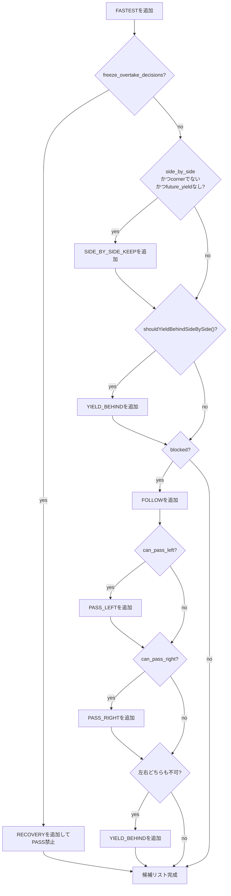

さらに、現在がPASS系や `ABORT_RECOVERY` なら `RECOVERY` も評価対象に入ります。
SAFE_STOPが必要かどうかを見る前にも、通常fallback候補として `RECOVERY` が無ければ追加します。

### スコアと候補選択

`candidateScore()` は、feasible候補の中でどれを優先するかを決めるコストを返します。

- `PASS_LEFT/RIGHT`: 前方閉塞時は低めのスコアで選ばれやすい。
- `YIELD_BEHIND`: future yield、コーナー横並び、pass gap喪失時に強く優先される。
- `SIDE_BY_SIDE_KEEP`: 直線寄りの横並びで優先される。
- `SAFE_STOP`: 回避不能時に最優先される。
- 現在モードに合う候補は `keep_mode_bonus` で少し優遇される。

`selectCandidate()` は、まず `feasible=true` の候補を必ず優先します。
全候補がunsafeのときだけ、診断やSAFE_STOP判断につなげるために、スコア最小のunsafe候補を返します。

### SAFE_STOP判定

SAFE_STOPは、通常の回避候補が全部ダメなときの低速停止overrideです。
物理的な緊急停止ではなく、`safe_stop_v_mps` の速度上限を持つ候補として扱われます。
発進直後の `start_grace` は、最初の有効ego受信時刻ではなく、最初に自車速度が動き出し判定を超えた時刻を基準にします。
これにより、AWSIMのWAIT_START中にSAFE_STOP猶予時間が消費されることを避けます。

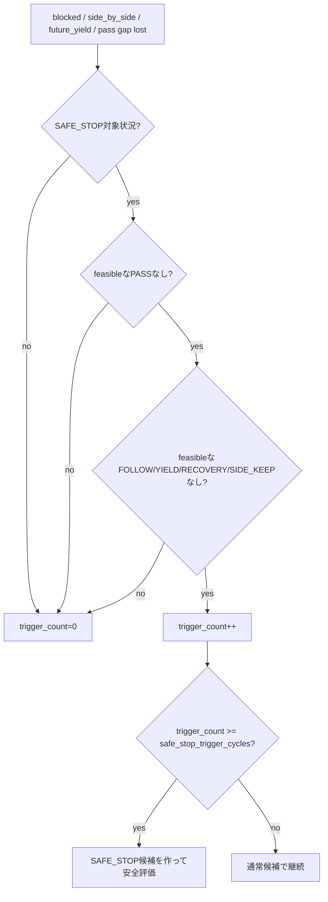

SAFE_STOP中は、解除条件が `safe_stop_release_cycles` 連続で満たされるまで保持されます。

### 横オフセットrate limit

`applyLateralTargetRateLimit()` は、前回publishした `d[]` と今回の `d[]` の差を `lateral_target_max_step_m` 以内に制限します。
ただし次の場合は制限しません。

- overrideが無効
- `SAFE_STOP`
- 前回publish情報がない
- 前回publishから `0.5 sec` 以上経過

## `src/blocked_risk_analyzer.cpp`

周辺の他車から、前方閉塞、横並び、追い越し可能幅を判定します。

### `detectBlocked()`

入力は `EgoState`、`OpponentState[]`、現在時刻です。
他車ごとに次を計算します。

- `delta_s`: 自車から相手までの前方距離。周回を考慮して正の前方距離として計算。
- `signed_delta_s`: 前後どちらにいるかを符号付きで見る距離。
- `delta_d`: 相手の横位置から自車の横位置を引いた値。
- `s_dot`: 相手速度を参照線接線方向へ射影した値。
- `same_direction`: `s_dot` が正方向なら同方向とみなす。

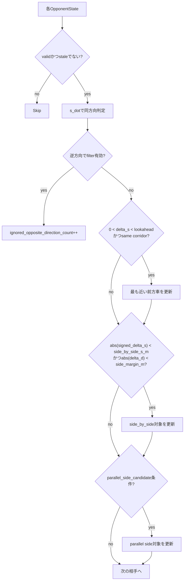

`blocked` は、前方車が見つかったあとに次で決まります。

```text
closing = front_rel_v > dv_block_threshold_mps
slow_gap = front_delta_s < follow_trigger_s_m
blocked = closing || slow_gap
```

つまり、単に前方にいるだけではなく、同一コリドー内で近い、または詰まりつつあることを見ています。
さらに `same_direction_filter_enabled` が有効なら、明確に逆方向へ進む相手は無視されます。

### `evaluatePassGap()`

前方車または横並び対象をtargetにして、左右の通過可能幅を計算します。

```text
lower_d = d_min_m + min_wall_margin_m
upper_d = d_max_m - min_wall_margin_m
ellipse_gap = safety_ellipse_b_m * sqrt(1 + min_ellipse_h)
pass_gap_required_m = max(min_pass_gap_m, ellipse_gap)
```

targetの現在位置と予測 `d[]` を見て、左右の最小gapを求めます。
現在すでに左追い越し中なら左側だけ `pass_gap_hysteresis_m` ぶん判定を甘くします。
右も同様です。

`pass_gap_reason` は次の値を取ります。

- `ok`
- `left_gap_narrow`
- `right_gap_narrow`
- `both_gap_narrow`
- `no_target`
- `large_lateral_error`

`large_lateral_error` の場合は、pass gap自体が空いていても、横ずれが大きい危険文脈で `pass_decision_frozen=true` になり、PASS開始を一時的に凍結しています。

## `src/future_side_by_side_risk_analyzer.cpp`

現在の横並び、または少し広めに拾った `parallel_side_candidate` を、短時間先まで伸ばして評価します。
目的は「今はギリギリ大丈夫でも、コーナーに入ると外側車両が逃げ場を失う」状況を早めに `YIELD_BEHIND` へ倒すことです。

### 予測の考え方

このファイルは相手を本格的な運動モデルで予測しているわけではありません。
相手は参照線方向の速度 `s_dot` で等速に進むと仮定します。
自車は現在速度で進みつつ、`SIDE_BY_SIDE_KEEP` 相当の横ずれをsmoothstepで入れると仮定します。

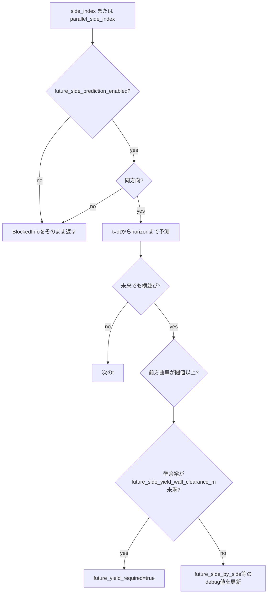

主に更新する `BlockedInfo` のフィールドは次です。

- `future_side_by_side`
- `future_corner_side_by_side`
- `future_outer_wall_risk`
- `future_yield_required`
- `future_delta_s`
- `future_delta_d`
- `future_wall_clearance_m`
- `future_abs_curvature`
- `predicted_opponent_s`
- `predicted_opponent_d`
- `future_prediction_time_sec`
- `yield_reason`

`yield_reason` は、外壁余裕が原因なら `future_outer_wall_risk` になります。

## `src/candidate_builder.cpp`

候補ごとの `d[]`, `x[]`, `y[]`, `yaw[]`, `v_ref[]` を作ります。
ここではまだ安全判定はしません。

### 候補ごとの目標d

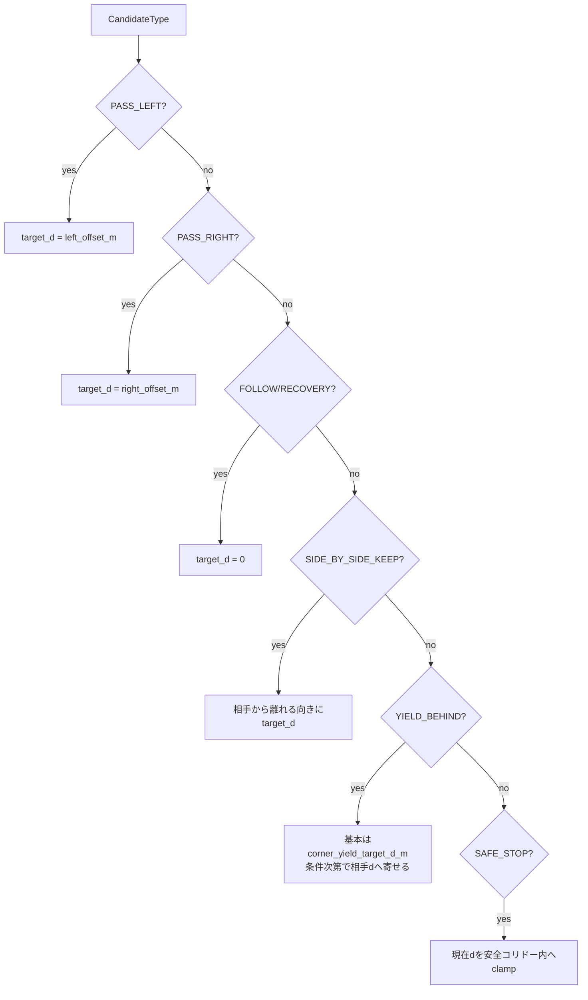

安全コリドーは次です。

```text
lower_d = d_min_m + min_wall_margin_m
upper_d = d_max_m - min_wall_margin_m
```

`SIDE_BY_SIDE_KEEP` では、相手が左側にいるなら右へ、右側にいるなら左へ逃げるように `away_sign` を決めます。
左右差がほぼ無い場合は、残り空間が広い側へ逃げます。

### 候補ごとの速度上限

| 候補 | 速度上限の決め方 |
| --- | --- |
| `FASTEST` | `v_passthrough_mps`。実質的に速度制限なし。 |
| `PASS_LEFT/RIGHT` | 基本は `v_passthrough_mps`。横オフセットで追い越す。 |
| `FOLLOW` | 前方車速度から `follow_speed_margin_mps` を引く。 |
| `RECOVERY` | `recovery_v_max_mps`。壁余裕が負なら `wall_margin_recovery_v_max_mps`。 |
| `SIDE_BY_SIDE_KEEP` | `side_by_side_speed_cap_mps` と、相手速度 minus `yield_speed_margin_mps` の小さい方。相手速度基準は `yield_min_speed_cap_mps` を下限にする。 |
| `YIELD_BEHIND` | target車速度 minus margin。target不明/低速時は `yield_min_speed_cap_mps` を使う。コーナーyieldなら `corner_yield_v_max_mps` でも上限をかける。 |
| `SAFE_STOP` | `safe_stop_v_mps`。 |

### horizon列生成

全候補で、`horizon_points` 回だけ次を作ります。

```text
t = i * horizon_dt_sec
ds = longitudinal_speed * t
s = wrapS(ego.s + ds)
ratio = smoothstep(ds / shift_distance)
d = start_d + (target_d - start_d) * ratio
cartesian = frame.frenetToCartesian(s, d)
```

`RECOVERY`, `YIELD_BEHIND`, `SAFE_STOP` は、開始dを安全コリドー内へclampしてから補間します。
これは、外側に出すぎている時にさらに外側へ向かう候補を作らないためです。

## `src/safety_evaluator.cpp`

候補が壁と他車に対して安全かを評価します。
結果は `CandidateTrajectory` に直接書き戻されます。

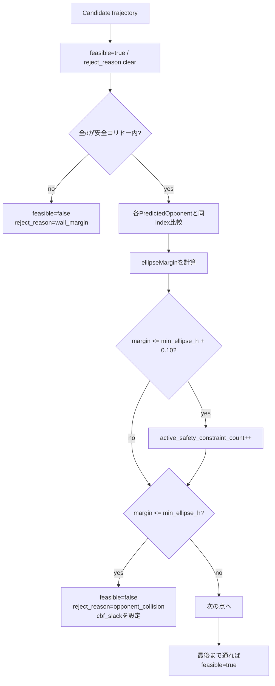

注意点は、壁マージンが先に評価されることです。
そのため、候補が壁も他車も危ない場合、`reject_reason` はまず `wall_margin` になります。

`ellipseMargin()` は自車候補点のyaw基準で相手位置をbody座標へ変換し、前後方向 `safety_ellipse_a_m`、横方向 `safety_ellipse_b_m` の楕円余裕 `h` を計算します。

```text
h = (x_body / a)^2 + (y_body / b)^2 - 1
safe if h > min_ellipse_h
```

## `src/behavior_state_machine.cpp`

候補選択結果を、そのまま運転モードへしないための状態機械です。
目的は、横オフセットや追い越し方向が毎周期ふらつくのを防ぐことです。

### 主な遷移

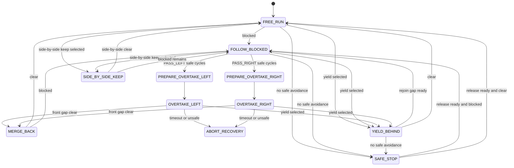

### チャタリング防止

`canSwitch()` は `now_sec - mode_enter_time_sec_ >= min_mode_hold_time_sec` を見ます。
PASS開始時は、`pass_safe_required_cycles` ぶん `PASS_LEFT` または `PASS_RIGHT` が連続して安全であると、`PREPARE_OVERTAKE_*` に入ります。

### future yield hold

`future_yield_required` で `YIELD_BEHIND` に入った場合、`future_yield_hold_active_` が立ちます。
解除には、最低保持時間、横位置の復帰、壁余裕、前方gap、コーナー文脈の解消が必要です。
これにより、コーナー入口で一瞬だけ条件が消えてもすぐ横並びへ戻らないようにしています。

### SAFE_STOP中

SAFE_STOP中は、`safe_stop_context.release_ready` が `safe_stop_release_cycles` 連続でtrueになるまで保持します。
SAFE_STOP候補自体がinfeasibleになった場合は、状況に応じて `YIELD_BEHIND`、`SIDE_BY_SIDE_KEEP`、`FOLLOW_BLOCKED`、`ABORT_RECOVERY` へ逃がします。

## `src/planner_output_builder.cpp`

選ばれた候補とmodeを、publishできる `PlannerOutput` へ変換します。
ここで速度guardも統合されます。

### override有効化

基本ルールは次です。

```text
if selected.type == SAFE_STOP:
  active if selected.feasible
else:
  active if selected.type != FASTEST
            and !safe_stop_candidate_infeasible
            and selected.feasible
```

つまり `FASTEST` は元の参照を使うため、通常はoverrideなしです。

### 速度guard

横方向候補が使えない場合でも、速度だけ落としたい状況があります。
`PlannerOutputBuilder` は次のguardを統合します。

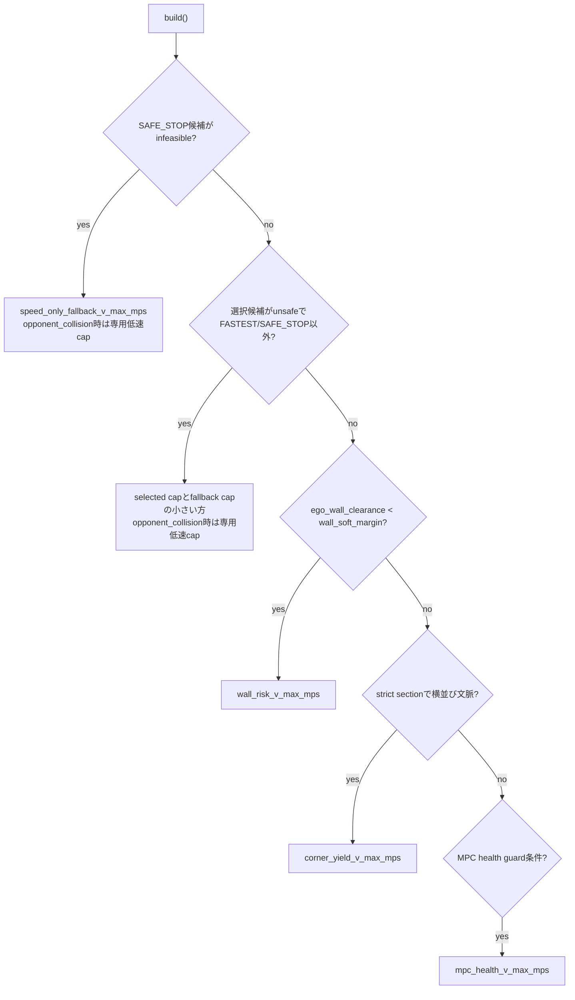

guardが要求された場合の挙動は2種類です。

- すでに横方向overrideが有効なら、既存の `speed_caps[]` に一様な上限をかける。
- 横方向overrideが無効なら、現在dを保持する `d[]` と速度上限 `v_ref[]` を作り、`active_override=true` にする。

後者では、元のmodeが `FREE_RUN` なら `SPEED_GUARD` に変わります。

## `src/frenet_frame.cpp`

MPCと同じ参照CSVを読み、Frenet座標変換を提供します。

### CSV読み込み

`loadCsv()` はヘッダ名で次を読みます。

- `s_m`
- `x_m`
- `y_m`
- `psi_rad`
- `kappa_radpm`
- `vx_mps`

`s_m` がNaNの場合は、隣接点距離から累積sを補完します。
コースは閉ループとして扱い、最後の点から先頭点までの距離も `track_length_` に含めます。

### 座標変換

`cartesianToFrenet()` は、最近傍の参照点を探し、その参照点のyawを使って横ずれを計算します。
線分への厳密な射影ではないため、参照点間隔が荒い場所では `s` が最近傍点単位で丸まりやすいです。

```text
dx = x - ref.x
dy = y - ref.y
d = cos(ref.yaw) * dy - sin(ref.yaw) * dx
yaw_error = normalizeAngle(yaw - ref.yaw)
```

`frenetToCartesian()` は中心線上の点から法線方向へ `d` だけずらします。

```text
x = ref.x - d * sin(ref.yaw)
y = ref.y + d * cos(ref.yaw)
```

このため、カーブでは同じ `d` でも地図上の見え方が外側へ膨らんで見えることがあります。

## テストとの対応

| テストファイル | 主に見ていること |
| --- | --- |
| `test/test_frenet_frame.cpp` | CSVなしでも参照点からFrenet変換とwrapが動くこと。 |
| `test/test_safety_evaluator.cpp` | 壁マージン、他車楕円、clear候補の判定。 |
| `test/test_state_machine.cpp` | mode遷移、保持、SAFE_STOP解除など。 |
| `test/test_overtake_planner_core.cpp` | 横並び、コーナーyield、未来コーナー、safe stop、speed guardなどの統合挙動。 |

## デバッグ時の見方

### overrideが出ているか

`/debug/overtake/metrics` の `active_override` を見ます。
`active_override=false` の場合、`/overtake/reference_override` はpublishされていても `n=0` です。

### なぜ追い越ししないか

次を順番に見ます。

1. `blocked`
2. `front_vehicle_id`
3. `parallel_side_vehicle_id`
4. `slow_obstacle_chain_active`
5. `can_pass_left`
6. `can_pass_right`
7. `pass_decision_frozen`
8. `pass_decision_freeze_reason`
9. `pass_gap_reason`
10. `straight_overtake_start_allowed`
11. `overtake_start_gate_reason`
12. `selected`
13. `reason`

コーナーで追い越し開始しない場合、`straight_overtake_start_allowed=false` かつ `overtake_start_gate_reason=curve` なら、直線限定ゲートで止めています。
`overtake_start_gate_reason=slow_front_exception_curve` の場合は、停止/低速車例外によって曲率ゲートだけが解除されており、pass gapや安全評価は引き続き有効です。
1台目通過後に2台目へ向かわない場合は、`slow_obstacle_chain_active` が立っているかを先に見ます。
立っていないなら、2台目が前方側のparallel-sideとして認識されていない、速度が低速条件を満たしていない、または距離が `slow_obstacle_chain_distance_m` を超えています。

### なぜYIELD_BEHINDになるか

次を見ると原因を分けやすいです。

- `side_by_side`
- `corner_side_by_side`
- `future_side_by_side`
- `future_corner_side_by_side`
- `future_outer_wall_risk`
- `future_yield_required`
- `yield_reason`
- `future_wall_clearance_m`

`yield_reason=future_outer_wall_risk` なら、今の位置だけでなく未来予測で外壁余裕が足りないと判断しています。

### なぜSAFE_STOPになるか

次を見ます。

- `safe_stop_triggered`
- `safe_stop_reason`
- `safe_stop_reject_reason`
- `safe_stop_trigger_count`
- `safe_stop_hold_count`
- `safe_stop_release_count`
- `reason`

`safe_stop_reason=safe_stop_infeasible` の場合、停止候補自体も壁または他車判定でunsafeです。
その場合はplanner単体で安全な回避軌道を作れていない状態なので、上位failsafeや速度guardとの関係も確認が必要です。

### MPCが重い時

`PlannerOutputBuilder` は `/mpc/speed_profile_debug` 由来の `mpc_health` を見て、速度guardを出せます。

- `mpc_health_valid`
- `mpc_infeasible_count`
- `mpc_solve_time_ms`
- `mpc_health_age_sec`
- `mpc_health_speed_guard_active`
- `speed_cap_reason`

`speed_cap_reason=mpc_health_infeasible_guard` なら、MPC infeasible回数が閾値以上で速度上限を出しています。
`speed_cap_reason=mpc_health_solve_time_guard` なら、solve timeが警告閾値以上です。
`speed_cap_reason=mpc_health_stale_guard` なら、MPC health情報が古い状態です。

## 実装上の注意点

- `BlockedRiskAnalyzer` は前方と横並びをFrenet座標で判定します。地図上の見た目だけで判断していません。
- `same_direction_filter_enabled` が有効なら、明確に逆方向へ進む相手は無視します。
- `FutureSideBySideRiskAnalyzer` は軽量な等速予測です。相手の操舵や加減速を厳密には予測しません。
- `SafetyEvaluator` は壁判定を先に行うため、壁も他車も危ない候補では `reject_reason=wall_margin` が先に出ます。
- `SAFE_STOP` は低速停止意図のoverrideであり、車両システム全体の緊急停止ではありません。
- `SPEED_GUARD` は横に避ける候補ではなく、現在dを保ったまま速度だけ落とす出力です。
- `frenetToCartesian()` は法線方向オフセットなので、カーブの外側では軌跡が膨らんで見えます。
